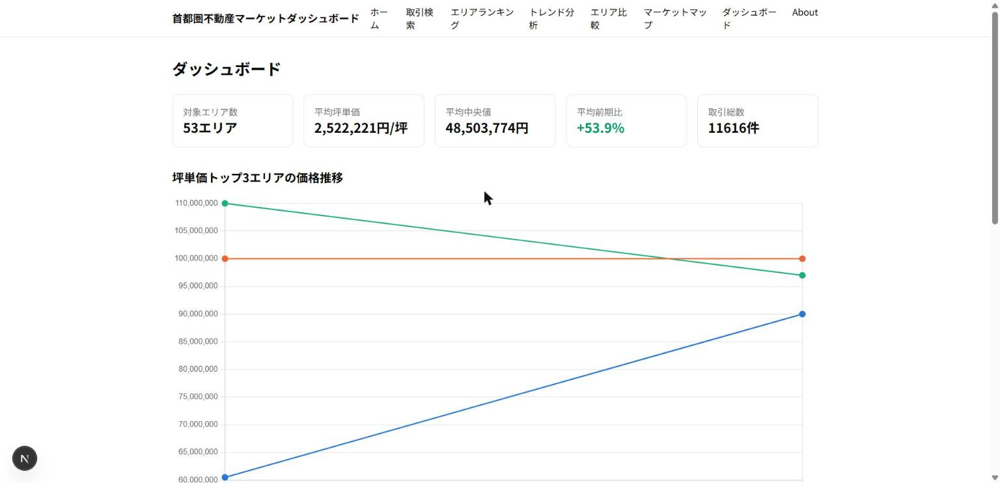
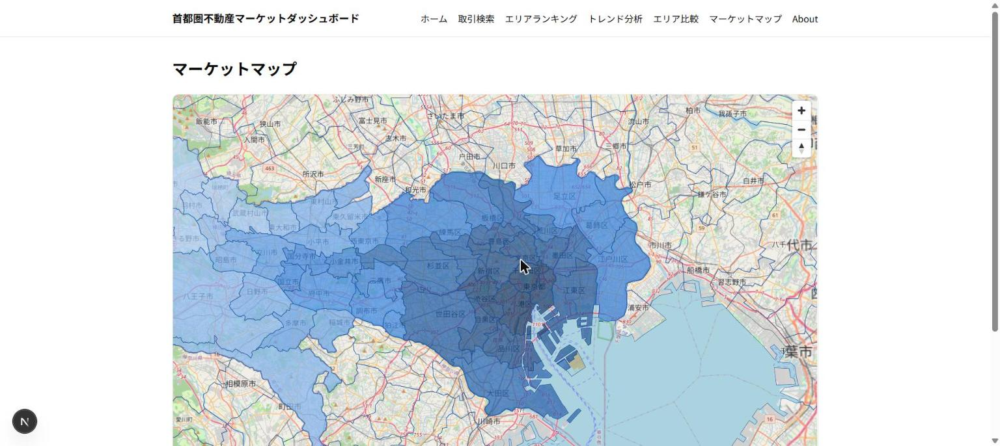
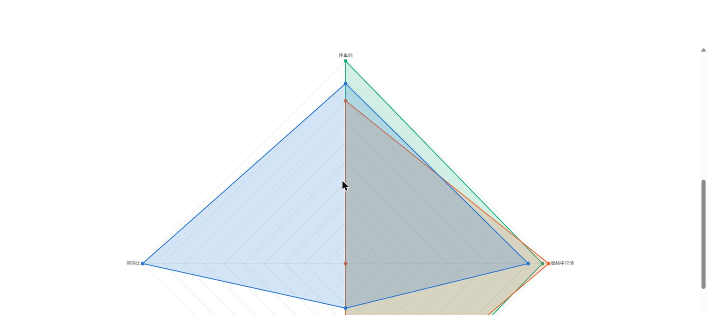
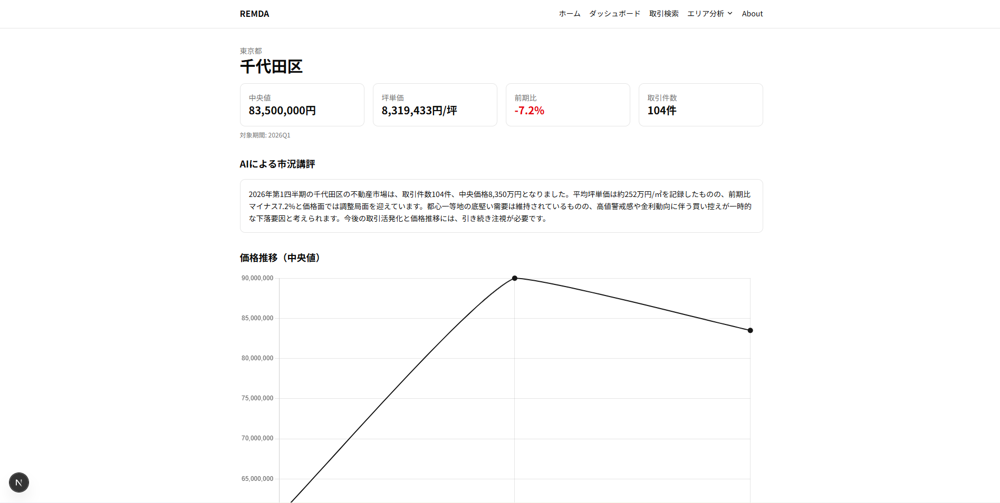
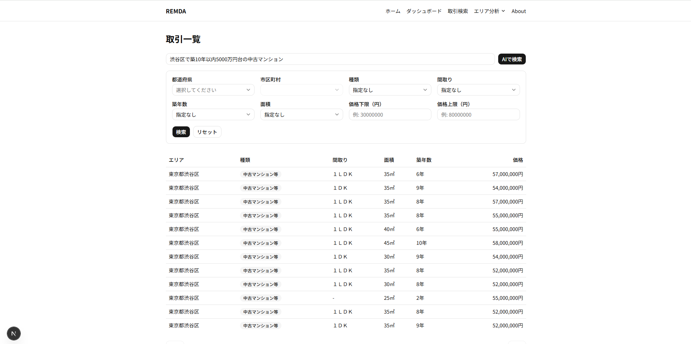
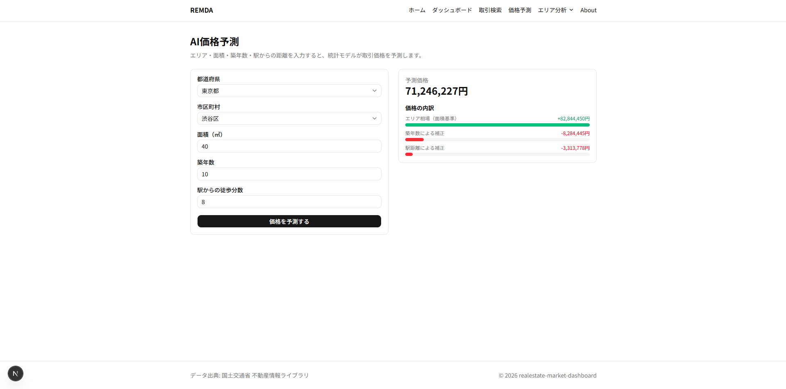
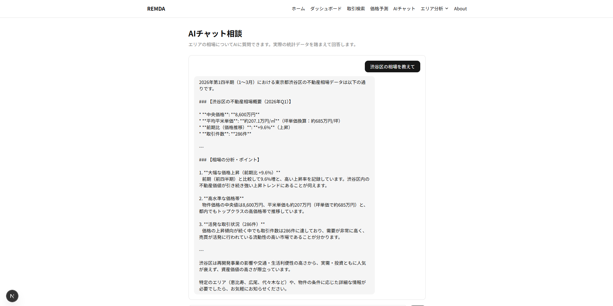

# REMDA — Real Estate Market Dashboard

関東1都3県（東京都・神奈川県・千葉県・埼玉県）の不動産市場を、国土交通省「不動産情報ライブラリ」の実取引データから検索・比較・可視化するWebアプリケーションです。

[デモを見る](https://realestate-market-dashboard.vercel.app/) · [設計書](./docs/design.md) · [ロードマップ](./docs/roadmap.md) · [ADR](./docs/adr/)

## Phase 3で実装したこと

- 取引検索: 市区町村・物件種別・間取り・価格帯による絞り込みと詳細表示、自然文検索（AI）
- エリア分析: 中央値・坪単価・前期比・価格推移・間取り分布、AIによる市況講評
- 市場比較: 坪単価ランキング、複数エリアの時系列比較、レーダーチャート
- マーケットマップ: MapLibre GLによる市区町村境界と坪単価ヒートマップ
- 統合ダッシュボード: 主要指標、トレンド、ランキング、地図を1画面に集約
- AI価格予測: エリア・面積・築年数から統計モデルで価格を推定し、寄与度を可視化
- AIチャット相談: エリアの相場について、実際の統計データを踏まえてAIが回答（ストリーミング表示）

## Phase 4で実装したこと

- デザインシステム: ディープネイビー基調のデザイントークンをCSS変数へ集約し、全画面で配色を統一
- ダーク・ライトテーマ: next-themesによる切替、Chart.jsの文字・グリッド・ツールチップ色もテーマ連動
- レスポンシブ対応: モバイルナビゲーション（ハンバーガーメニュー）、地図・グラフのモバイルレイアウト調整
- ローディング表示: 主要ページにスケルトンを追加し、データ取得中のレイアウトシフトを防止
- エラー画面: 通常エラー・重大エラー・404ページをデザインし、トースト通知の基盤を整備
- グラフのアクセシビリティ: WCAGコントラスト比を検証し、ダーク・ライト双方で判読しやすい配色に調整
- アクセシビリティ改善: スキップリンク、フォーカス表示、フォームのaria-invalid/aria-describedby対応。全ページでLighthouseアクセシビリティスコア100点
- トップ・Aboutページ強化: 実データを表示するヒーロー、アーキテクチャ図を含む開発背景の掲載

## スクリーンショット

| 統合ダッシュボード | 坪単価ヒートマップ | エリア比較（レーダーチャート） |
|---|---|---|
|  |  |  |

| AIによる市況講評 | 自然文検索 | AI価格予測 | AIチャット相談 |
|---|---|---|---|
|  |  |  |  |

## 技術的な特徴

- **Feature First × Clean Architecture × DDD**: 機能単位でdomain / application / infrastructure / presentationを分離
- **型安全な境界**: Zodによる入力検証、Result型によるユースケースの成功・失敗表現、共通APIエラー形式
- **分析向け集計**: 市区町村×四半期で統計を事前集計し、IQR法で価格外れ値を除去
- **表示性能への配慮**: Server Components、集計済みテーブル、APIキャッシュ、ズームレベル別の地図データ取得
- **品質管理**: TypeScript、ESLint、Vitest、GitHub Actionsによる継続的な検証

## 技術スタック

| 分類 | 技術 |
|---|---|
| フロントエンド | Next.js 16 (App Router), React 19, TypeScript, Tailwind CSS, shadcn/ui |
| 可視化 | MapLibre GL, Chart.js, GeoJSON |
| バックエンド | Next.js Route Handlers, Supabase (PostgreSQL), Prisma 7, Zod |
| AI | Gemini API（構造化出力・ストリーミング）、Upstash Redis（レート制限） |
| テスト・運用 | Vitest, ESLint, GitHub Actions, Vercel |

## アーキテクチャ

```text
src/features/{feature}/
├── domain/          # Entity、Value Object、Repository interface
├── application/     # Use Case、Result
├── infrastructure/  # Prisma Repository、外部サービスとの接続
└── presentation/    # DTO、入力スキーマ、UI
```

依存方向を内側へ限定し、画面やデータベースの変更が市場分析のルールへ波及しにくい構成にしています。詳細と判断理由は[設計書](./docs/design.md)と[ADR](./docs/adr/)に記録しています。

## ローカルでの実行

Node.js 24系を使用します。

```bash
npm install
cp .env.example .env
npm run dev
```

`.env`にSupabaseの`DATABASE_URL`と`DIRECT_URL`を設定してください。APIから新たにデータを取得する場合のみ`REINFOLIB_API_KEY`も必要です。実データと秘密情報はリポジトリに含めていません。

## 品質チェック

```bash
npm run lint
npm run typecheck
npm test
npm run build
```

単体テストは33ファイル・141件がすべて成功しています。結合テストは実際のSupabaseへ接続するため、環境変数を設定した上で`npm run test:integration`を実行します。

本番ビルドに対するLighthouse監査（トップ・ダッシュボード・取引検索・AIチャット・AI価格予測の5ページ、デスクトップ・モバイル計測）では、Accessibility・Best Practices・SEOが全ページ100点です。Performanceはデスクトップ95〜100点、モバイルは56〜91点（地図とグラフを同時に読み込むダッシュボードが最も重い）でした。

## データ更新

```bash
npm run fetch:reinfolib -- --area 13 --quarters 4
npm run db:seed
npm run db:aggregate
```

取得元: [国土交通省 不動産情報ライブラリ](https://www.reinfolib.mlit.go.jp/)

## 主なページ

| パス | 内容 |
|---|---|
| `/dashboard` | 主要統計・価格トレンド・ランキング・地図の統合ビュー |
| `/transactions` | 実取引の検索・一覧 |
| `/areas` | 市区町村別ランキング |
| `/areas/[code]` | エリア詳細と価格推移・間取り分布 |
| `/trends` | 複数エリアの時系列比較 |
| `/areas/compare` | エリア比較 |
| `/map` | 坪単価ヒートマップ |
| `/ai/predict` | AI価格予測（参考推定。統計データを基準にしたルールベースの推定であり、鑑定・査定ではありません） |
| `/ai/chat` | AIチャット相談（実データを踏まえて回答。現時点ではGeminiのみ対応） |

## 開発状況

- Phase 1: 取引検索、データ取込基盤、アーキテクチャ基盤 — 完了
- Phase 2: エリア分析、比較、地図、統合ダッシュボード — 完了
- Phase 3: 自然言語検索、AIエリア講評、AIチャット、AI価格予測 — 完了
- Phase 4: UI改善（デザインシステム・ダークモード・レスポンシブ・アクセシビリティ） — 完了

このリポジトリは転職活動用ポートフォリオとして整備しています。
