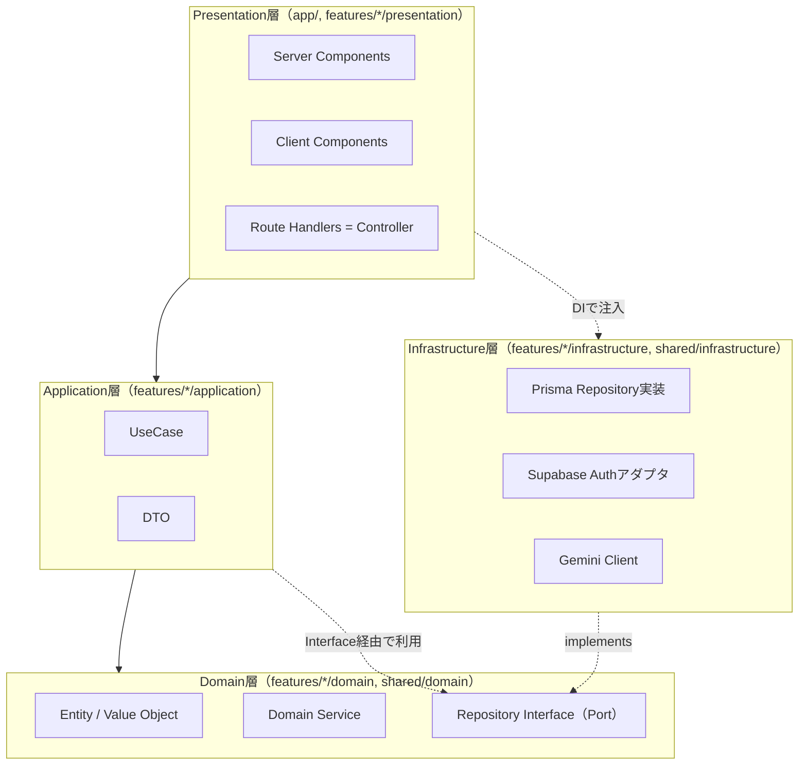
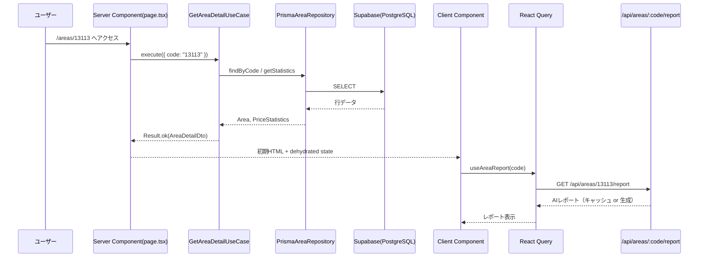
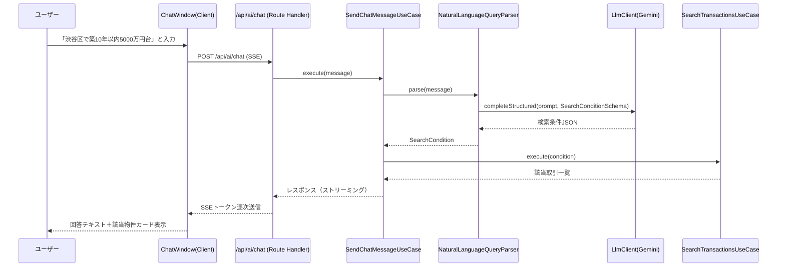

# REMDA（首都圏不動産マーケットダッシュボード） 設計書

- 作成日: 2026-07-24
- バージョン: v0.1（初版）
- 前提ドキュメント: [`requirements.md`](./requirements.md)
- 本書の位置づけ: 要件定義書で定めた機能を、以下の技術構成・設計思想でどう実装するかを定義する詳細設計書

## 技術構成（本設計での確定スタック）

| 分類 | 技術 |
|---|---|
| フレームワーク | Next.js（App Router） |
| 言語 | TypeScript |
| スタイリング | Tailwind CSS + shadcn/ui |
| DB / BaaS | Supabase（PostgreSQL、Auth、Storage） |
| ORM | Prisma |
| 地図 | MapLibre GL JS |
| グラフ | Chart.js（react-chartjs-2経由） |
| サーバー状態管理 | React Query（TanStack Query） |
| バリデーション | Zod |
| フォーム | React Hook Form |
| AI | Gemini API（無料枠で利用可能。OpenAI/Claude APIへの切り替えも可能なAdapter構成） |
| ホスティング | Vercel |
| CI/CD | GitHub Actions |
| 設計思想 | Clean Architecture ／ Feature First ／ DDD（軽量適用） |

> 前回の要件定義書ではPython分析基盤を分離するモノレポ構成を提案したが、本設計ではNext.js単体（Supabase含む）で完結させる構成に変更する。価格予測は当面ヒューリスティック／統計的手法をTypeScriptで実装し、`PricePredictionModel`インターフェースの実装を差し替えるだけでPython製MLサービスに将来移行できるようにする（詳細は7章）。

---

## 1. アーキテクチャ方針

### 1.1 なぜ Clean Architecture × Feature First × DDD を組み合わせるか

- **Clean Architecture**: UI・フレームワーク・DB・外部APIといった変わりやすい部分から、ビジネスルール（ドメインロジック）を独立させる。「AIプロバイダをOpenAIからClaudeに差し替える」「PrismaからDrizzleに変える」といった変更がドメイン層に波及しないことを保証する。
- **Feature First**: レイヤーだけで分割すると機能追加のたびに複数ディレクトリを横断編集することになり、認知負荷が上がる。機能（Bounded Contextに近い単位）でディレクトリを凝集させ、1機能=1フォルダで完結させる。
- **DDD（軽量適用）**: 不動産ドメインは「坪単価」「取引時期」「価格帯」など単なるプリミティブ型では表現しきれない概念が多い。値オブジェクト・エンティティ・ドメインサービスとしてモデル化することで、ビジネスルールの所在を明確にし、バリデーションロジックの重複を防ぐ。厳密なCQRS/イベントソーシングまでは採用せず、**エンティティ／値オブジェクト／集約／リポジトリインターフェース／ドメインサービス**の5点に絞って適用する（オーバーエンジニアリングを避ける）。

### 1.2 レイヤー構成と依存方向



依存性のルール:
- 内側（Domain）は外側（Infrastructure, Presentation）を一切importしない。
- RepositoryやAIクライアントは Domain層に **interface（Port）** を定義し、Infrastructure層がそれを **実装（Adapter）** する（依存性逆転の原則）。
- UseCaseはコンストラクタ引数でRepositoryインターフェースを受け取り、具象クラスを知らない。実際のインスタンス化（DI）はfeatureごとの`container.ts`が担い、Route Handlerはcontainerからcomposeされた UseCase を取得して呼び出すだけにする。
- ESLintの `no-restricted-imports` で「`domain`配下から`infrastructure`配下へのimportを禁止」をルール化し、レイヤー違反をCIで機械的に検出する（12章）。

### 1.3 Bounded Context（DDDにおける機能境界）

| コンテキスト | 責務 | 主なドメインオブジェクト |
|---|---|---|
| **Market**（市場分析） | エリア統計、トレンド、AI講評、エリア比較 | `Area`, `PriceStatistics`, `TrendRate`, `AreaMarketSnapshot` |
| **Transaction**（取引） | 取引データの検索・詳細表示 | `Transaction`, `Money`, `FloorPlan`, `BuildingAge` |
| **Prediction**（価格予測） | 特徴量入力からの価格推定 | `PredictionInput`, `PredictionResult` |
| **Conversation**（AI対話） | 自然言語検索・チャット相談 | `ChatSession`, `ChatMessage` |
| **Identity**（ユーザー） | 認証・お気に入り・保存検索 | `User`, `FavoriteArea`, `SavedSearch` |

各コンテキストが `features/{context}` に対応する。複数コンテキストで使う基礎的な値オブジェクト（`Prefecture`, `MunicipalityCode`, `DomainError`）は `shared/domain` に置く共有カーネルとする。

---

## 2. ディレクトリ構成

```
realestate-market-dashboard/
├── src/
│   ├── app/                                   # Presentation層：ルーティングと薄いページのみ
│   │   ├── (marketing)/page.tsx
│   │   ├── (marketing)/about/page.tsx
│   │   ├── dashboard/page.tsx
│   │   ├── areas/page.tsx
│   │   ├── areas/[code]/page.tsx
│   │   ├── areas/compare/page.tsx
│   │   ├── transactions/page.tsx
│   │   ├── transactions/[id]/page.tsx
│   │   ├── trends/page.tsx
│   │   ├── ai/chat/page.tsx
│   │   ├── ai/predict/page.tsx
│   │   ├── favorites/page.tsx
│   │   ├── login/page.tsx
│   │   ├── layout.tsx / error.tsx / not-found.tsx / loading.tsx
│   │   └── api/                               # Route Handlers = Controller
│   │       ├── areas/route.ts
│   │       ├── areas/[code]/route.ts
│   │       ├── areas/[code]/report/route.ts
│   │       ├── areas/compare/route.ts
│   │       ├── transactions/route.ts
│   │       ├── transactions/[id]/route.ts
│   │       ├── trends/route.ts
│   │       ├── map/heatmap/route.ts
│   │       ├── search/nl/route.ts
│   │       ├── ai/predict/route.ts
│   │       ├── ai/chat/route.ts
│   │       ├── favorites/route.ts
│   │       └── saved-searches/route.ts
│   │
│   ├── features/                               # Feature First × Clean Architecture
│   │   ├── market/
│   │   │   ├── domain/
│   │   │   │   ├── entities/area.ts
│   │   │   │   ├── value-objects/unit-price.ts
│   │   │   │   ├── value-objects/price-statistics.ts
│   │   │   │   ├── value-objects/trend-rate.ts
│   │   │   │   ├── aggregates/area-market-snapshot.ts
│   │   │   │   ├── services/market-statistics-calculator.ts
│   │   │   │   └── repositories/area-repository.ts        # interface
│   │   │   ├── application/
│   │   │   │   ├── use-cases/list-areas.usecase.ts
│   │   │   │   ├── use-cases/get-area-detail.usecase.ts
│   │   │   │   ├── use-cases/get-area-report.usecase.ts
│   │   │   │   ├── use-cases/compare-areas.usecase.ts
│   │   │   │   ├── use-cases/get-trends.usecase.ts
│   │   │   │   └── dto/area-dto.ts
│   │   │   ├── infrastructure/
│   │   │   │   ├── prisma-area-repository.ts
│   │   │   │   ├── ai-report-generator.ts                  # Gemini呼び出し
│   │   │   │   └── container.ts                            # DIコンポジションルート
│   │   │   └── presentation/
│   │   │       ├── components/AreaRankingTable.tsx
│   │   │       ├── components/AreaDetailHeader.tsx
│   │   │       ├── components/AreaReportPanel.tsx
│   │   │       ├── components/AreaComparisonView.tsx
│   │   │       └── hooks/useAreaDetail.ts
│   │   │
│   │   ├── transaction/
│   │   │   ├── domain/{entities/transaction.ts, value-objects/{money,floor-plan,building-age}.ts, repositories/transaction-repository.ts}
│   │   │   ├── application/use-cases/{search-transactions,get-transaction-detail}.usecase.ts
│   │   │   ├── infrastructure/{prisma-transaction-repository.ts, container.ts}
│   │   │   └── presentation/{components/{TransactionFilterPanel,TransactionTable,TransactionDetailCard}.tsx, hooks/useTransactionSearch.ts}
│   │   │
│   │   ├── prediction/
│   │   │   ├── domain/{value-objects/{prediction-input,prediction-result}.ts, services/price-prediction-model.ts}  # interface
│   │   │   ├── application/use-cases/predict-price.usecase.ts
│   │   │   ├── infrastructure/{heuristic-price-prediction-model.ts, container.ts}
│   │   │   └── presentation/{components/{PredictForm,PredictResultCard,FeatureImportanceBar}.tsx, hooks/usePredictPrice.ts}
│   │   │
│   │   ├── conversation/
│   │   │   ├── domain/{entities/{chat-session,chat-message}.ts, services/natural-language-query-parser.ts, repositories/chat-repository.ts}
│   │   │   ├── application/use-cases/{send-chat-message,parse-natural-language-search}.usecase.ts
│   │   │   ├── infrastructure/{prisma-chat-repository.ts, llm-client.ts, container.ts}   # llm-client.tsがGemini/OpenAI/Claude切り替えAdapter
│   │   │   └── presentation/{components/{ChatWindow,ChatMessageBubble,ChatSuggestionChips}.tsx, hooks/useChat.ts}
│   │   │
│   │   └── identity/
│   │       ├── domain/{entities/{favorite-area,saved-search}.ts, repositories/{favorite-repository,saved-search-repository}.ts}
│   │       ├── application/use-cases/{add-favorite,remove-favorite,list-favorites,save-search}.usecase.ts
│   │       ├── infrastructure/{prisma-favorite-repository.ts, supabase-auth-adapter.ts, container.ts}
│   │       └── presentation/{components/{FavoriteButton,SavedSearchList}.tsx, hooks/useFavorites.ts}
│   │
│   ├── shared/                                 # 共有カーネル・横断的関心事
│   │   ├── domain/{value-objects/{prefecture,municipality-code}.ts, errors/domain-error.ts}
│   │   ├── application/{result.ts, application-error.ts}
│   │   ├── infrastructure/
│   │   │   ├── prisma/client.ts
│   │   │   ├── supabase/{server-client.ts, browser-client.ts, middleware-client.ts}
│   │   │   ├── logger/logger.ts
│   │   │   └── cache/query-cache-headers.ts
│   │   └── ui/
│   │       ├── components/ui/                  # shadcn/ui 由来
│   │       ├── components/charts/{PriceTrendChart,AreaComparisonRadar,PriceDistributionHistogram}.tsx
│   │       └── components/map/MarketMap.tsx
│   │
│   └── middleware.ts                           # Supabaseセッション検証・保護ルート制御
│
├── prisma/schema.prisma
├── supabase/migrations/                        # RLSポリシー含む
├── tests/
│   ├── unit/                                   # Domain/Application層（Vitest）
│   ├── integration/                            # Route Handlers（Vitest + msw）
│   └── e2e/                                    # Playwright
├── .github/workflows/ci.yml
├── docs/{requirements.md, design.md}
└── package.json
```

**Feature First×Clean Architectureの融合ルール**: 各featureは `domain / application / infrastructure / presentation` の4層を持つが、機能規模に応じて省略可（例: `identity`は集約やドメインサービスを持たずEntity+Repositoryのみで十分）。過剰な抽象化を避け、「本当に差し替え可能性がある境界（DB・外部API・AIプロバイダ）」にのみinterfaceを立てる。

---

## 3. ドメインモデル設計（DDD）

### 3.1 Market コンテキスト

```typescript
// features/market/domain/value-objects/unit-price.ts
export class UnitPrice {
  private constructor(private readonly yenPerSqm: number) {
    if (yenPerSqm < 0) throw new InvalidUnitPriceError(yenPerSqm);
  }
  static fromTotal(price: Money, areaSqm: number): UnitPrice {
    return new UnitPrice(price.yen / areaSqm);
  }
  toTsubo(): number { return this.yenPerSqm * 3.30578; }
}

// features/market/domain/value-objects/price-statistics.ts
export class PriceStatistics {
  private constructor(
    readonly median: Money,
    readonly average: Money,
    readonly q1: Money,
    readonly q3: Money,
    readonly sampleSize: number,
  ) {}
  static calculate(prices: Money[]): PriceStatistics {
    // 外れ値除去（IQR法）→ 中央値・四分位数を算出するドメインロジック
  }
}

// features/market/domain/services/market-statistics-calculator.ts
export interface MarketStatisticsCalculator {
  calculateSnapshot(transactions: Transaction[], period: string): AreaMarketSnapshot;
  calculateTrendRate(current: PriceStatistics, previous: PriceStatistics): TrendRate;
}
```

- **Entity**: `Area`（同一性はcodeで判定、名称や境界が変わってもエリアとしての同一性は保たれる）
- **Value Object**: `UnitPrice`, `PriceStatistics`, `TrendRate`（不変・値による等価性）
- **Aggregate**: `AreaMarketSnapshot`（`Area` + `PriceStatistics` + `TrendRate` + 対象期間をひとつの整合性単位として扱う）
- **Domain Service**: `MarketStatisticsCalculator`（外れ値除去・統計量計算という「単一エンティティに属さない」ロジックを担う）
- **Repository Interface**: `AreaRepository`, `AreaStatisticsRepository`, `AiAreaReportRepository`

### 3.2 Transaction コンテキスト

- **Entity**: `Transaction`（id同一性、価格・面積・築年数等の属性を保持）
- **Value Object**: `Money`（通貨計算の丸め誤差防止のため常に整数円で保持）、`FloorPlan`（間取り表記の正規化: "3LDK" 等）、`BuildingAge`（築年数、経過年数の計算ロジックを内包）

### 3.3 Prediction コンテキスト

```typescript
// features/prediction/domain/services/price-prediction-model.ts
export interface PricePredictionModel {
  predict(input: PredictionInput): Promise<PredictionResult>;
}
```

- 初期実装 `HeuristicPricePredictionModel`（Infrastructure層）は、市区町村平均坪単価×面積を基準に築年数・駅距離で補正する統計的モデル（重回帰係数はエリア統計から事前算出しDBに保持）。
- 将来的にPython製MLサービス（LightGBM等）をAPI経由で呼ぶ `RemoteMlPricePredictionModel` に差し替えても、Application層・Presentation層は一切変更不要（Portを介した差し替え可能性の実例）。

### 3.4 Conversation コンテキスト

- **Entity**: `ChatSession`, `ChatMessage`
- **Domain Service**: `NaturalLanguageQueryParser`（自然文 → 検索条件への変換をinterfaceとして抽象化、実装はLLM呼び出し）

### 3.5 Identity コンテキスト

- **Entity**: `FavoriteArea`, `SavedSearch`（Supabase Authが発行する`user.id`をそのまま外部キーとして利用し、独自の`User`エンティティは持たない＝認証の実体はSupabaseに委譲するミニマル設計）

---

## 4. 画面ごとの責務

| 画面 | 種別 | 責務 | 呼び出すUseCase | 認証 |
|---|---|---|---|---|
| `/`（LP） | Server Component | プロダクト紹介の静的表示、主要導線提示 | なし | 不要 |
| `/dashboard` | Server Component + Client island | 初期統計をサーバーでprefetchし地図・サマリーをレンダリング。地図操作やフィルタはClient Component | `ListAreas`, `GetTrends` | 不要 |
| `/areas` | Server Component | エリアランキングの初期表示、並べ替えUIはClient Component | `ListAreas` | 不要 |
| `/areas/[code]` | Server Component | エリア詳細の初期データ取得・メタデータ生成（OGP等）、AIレポートはストリーミング表示のためClient Component | `GetAreaDetail`, `GetAreaReport` | 不要 |
| `/areas/compare` | Client Component | クエリパラメータ（比較対象コード）に応じた動的取得・比較表示 | `CompareAreas` | 不要 |
| `/transactions` | Server Component + Client island | 初期検索結果のSSR、フィルタ操作はClient Component | `SearchTransactions` | 不要 |
| `/transactions/[id]` | Server Component | 取引詳細と周辺相場の表示 | `GetTransactionDetail` | 不要 |
| `/trends` | Client Component | 複数エリアの時系列比較（インタラクティブなグラフ操作が中心） | `GetTrends` | 不要 |
| `/ai/chat` | Client Component | チャットUIの状態管理、SSEでのストリーミング受信 | `SendChatMessage` | 不要（ただし送信回数はIPベースでレート制限） |
| `/ai/predict` | Client Component | フォーム入力（React Hook Form）→予測結果表示 | `PredictPrice` | 不要 |
| `/favorites` | Server Component（要認証） | ログインユーザーのお気に入り・保存検索一覧表示 | `ListFavorites`, `ListSavedSearches` | **必須** |
| `/login` | Client Component | Supabase AuthによるGoogle OAuthログインフロー | - | - |
| `/about` | Server Component | 技術スタック・アーキテクチャ解説（静的） | なし | 不要 |

設計方針: **「閲覧系は完全に認証不要」**とし、ポートフォリオとして誰でも全機能をすぐ試せることを最優先する。認証はお気に入り・保存検索という「個人に紐づく状態の永続化」にのみ必要とする。

---

## 5. コンポーネントの責務

Presentation層内をさらに3種類に分けて責務を明確化する。

| 種別 | 責務 | 例 |
|---|---|---|
| **Page（Server Component）** | ルーティング、初期データのprefetch、メタデータ生成、認証ガードの起点 | `app/areas/[code]/page.tsx` |
| **Container（Client Component, "use client"）** | React Queryでのデータ取得・更新、ローカルUI状態の保持、Presentationalへのprops受け渡し | `AreaDetailContainer` |
| **Presentational Component** | propsのみに依存し、副作用を持たない。Storybook等での単体確認・テストが容易 | `AreaRankingTable`, `PriceTrendChart` |
| **UI Component（shadcn/ui base）** | 汎用的な見た目・インタラクションのみ。ドメイン知識を一切持たない | `Button`, `Card`, `Dialog`, `Skeleton` |

### 5.1 主要コンポーネント一覧と責務

| コンポーネント | 所属feature | 責務 |
|---|---|---|
| `AreaRankingTable` | market | エリア一覧の表形式表示、列ソートのUIイベント発火（データ取得はContainerが担当） |
| `AreaDetailHeader` | market | エリア名・現在の統計サマリー（中央値・坪単価・前年比）の表示 |
| `AreaReportPanel` | market | AI生成レポートの表示、生成中/失敗時のフォールバックUI |
| `AreaComparisonView` | market | 複数エリアの指標を横並び表示（Chart.jsのレーダーチャート） |
| `TransactionFilterPanel` | transaction | 検索条件フォーム（React Hook Form + Zod）、URL query paramsへの同期 |
| `TransactionTable` | transaction | 検索結果一覧、ページネーションUI |
| `TransactionDetailCard` | transaction | 個別取引の詳細表示 |
| `PredictForm` | prediction | 予測用入力フォーム、バリデーションエラー表示 |
| `PredictResultCard` / `FeatureImportanceBar` | prediction | 予測結果と寄与度の可視化 |
| `ChatWindow` / `ChatMessageBubble` | conversation | チャットUI、ストリーミングトークンの逐次描画 |
| `FavoriteButton` | identity | お気に入り登録/解除のトグル、未ログイン時はログイン導線へリダイレクト |
| `MarketMap`（shared/ui） | shared | MapLibre GLインスタンス管理、メッシュヒートマップレイヤーの描画 |
| `PriceTrendChart`（shared/ui） | shared | Chart.js（Line）による時系列描画、ダークモード対応の配色 |

---

## 6. 状態管理設計

| 状態の種類 | 手段 | 理由 |
|---|---|---|
| サーバーデータ（取引一覧、エリア統計等） | **React Query** | キャッシュ・再検証・楽観的更新・リトライを宣言的に扱える。Server ComponentでのSSR初期データは`dehydrate`/`HydrationBoundary`でクライアントのReact Queryキャッシュへ引き継ぐ |
| 検索条件・フィルタ状態 | **URL Query Params**（`useSearchParams` + 独自hook） | 検索条件をURLに持たせることで「結果のシェア」「ブラウザバックでの状態復元」を自然に実現。グローバルなクライアント状態管理ライブラリを追加導入せず、React標準機能で完結させる |
| フォーム入力 | **React Hook Form + Zod resolver** | 入力状態とバリデーションを一体管理。送信時のスキーマがApplication層のDTOバリデーションと同一のZodスキーマを共有できる（`shared`にスキーマを配置し二重定義を防止） |
| UIローカル状態（モーダル開閉、タブ選択等） | `useState` / `useReducer`（コンポーネントローカル） | featureを跨がない一時的な状態のためグローバル管理は不要 |
| チャットのストリーミング状態 | Container内の`useReducer` + React QueryのMutation | メッセージ配列の逐次更新はReact Queryのキャッシュ更新API（`setQueryData`）で行い、単一の情報源を保つ |

**方針の要点**: グローバルクライアント状態管理ライブラリ（Zustand/Redux等）は今回のスタックに含めない。「サーバー由来はReact Query」「共有すべきクライアント状態はURL」「それ以外はローカルstate」の3分類で足りる規模と判断し、状態管理の複雑さを最小化する。

---

## 7. API構成

Route HandlersはClean Architectureにおける **Controller** として、以下の責務のみを持つ（ビジネスロジックを書かない）。

1. リクエストのパース・Zodバリデーション
2. featureの`container.ts`からUseCaseを取得
3. UseCase実行、Result型の成功/失敗で分岐
4. DTO→JSONレスポンスへの変換、エラー時は共通エラーハンドラに委譲

```typescript
// app/api/areas/[code]/route.ts
export async function GET(req: NextRequest, { params }: { params: { code: string } }) {
  const requestId = createRequestId();
  const query = AreaDetailQuerySchema.safeParse(Object.fromEntries(req.nextUrl.searchParams));
  if (!query.success) return badRequest(query.error, requestId);

  const useCase = marketContainer.getAreaDetailUseCase();
  const result = await useCase.execute({ code: params.code, period: query.data.period });

  return result.match(
    (dto) => NextResponse.json(dto, { headers: cacheHeaders("1h") }),
    (err) => handleRouteError(err, requestId),
  );
}
```

### 7.1 エンドポイント一覧

| Method | Endpoint | UseCase | 認証 |
|---|---|---|---|
| GET | `/api/areas` | `ListAreasUseCase` | 不要 |
| GET | `/api/areas/{code}` | `GetAreaDetailUseCase` | 不要 |
| GET | `/api/areas/{code}/report` | `GetAreaReportUseCase` | 不要 |
| GET | `/api/areas/compare` | `CompareAreasUseCase` | 不要 |
| GET | `/api/transactions` | `SearchTransactionsUseCase` | 不要 |
| GET | `/api/transactions/{id}` | `GetTransactionDetailUseCase` | 不要 |
| GET | `/api/trends` | `GetTrendsUseCase` | 不要 |
| GET | `/api/map/heatmap` | `GetHeatmapUseCase` | 不要 |
| POST | `/api/search/nl` | `ParseNaturalLanguageSearchUseCase` | 不要（レート制限あり） |
| POST | `/api/ai/predict` | `PredictPriceUseCase` | 不要 |
| POST | `/api/ai/chat` | `SendChatMessageUseCase` | 不要（レート制限あり） |
| GET/POST/DELETE | `/api/favorites` | `List/Add/RemoveFavoriteUseCase` | **必須** |
| GET/POST/DELETE | `/api/saved-searches` | `List/Save/DeleteSavedSearchUseCase` | **必須** |

### 7.2 AIプロバイダの抽象化

```typescript
// features/conversation/infrastructure/llm-client.ts
export interface LlmClient {
  completeStructured<T>(prompt: string, schema: z.ZodSchema<T>): Promise<T>;
  streamChat(messages: LlmChatMessage[]): AsyncIterable<string>;
}
export class GeminiLlmClient implements LlmClient { /* ... */ }
export class OpenAiLlmClient implements LlmClient { /* ... */ }
export class ClaudeLlmClient implements LlmClient { /* ... */ }
```

環境変数 `AI_PROVIDER=gemini|openai|claude`（デフォルト: `gemini`）によって `container.ts` が実装を選択する。UseCase・Presentation層はどのプロバイダかを一切知らない。

デフォルトプロバイダとして**Gemini API**を採用する。OpenAI/Claude APIには恒久的な無料枠が無く（新規登録時の少額トライアルクレジットのみ）、Gemini APIはGoogle AI Studio経由でFlash/Flash-Liteモデルがクレジットカード登録不要の無料枠として利用できるため（2026年8月時点）。`LlmClient`によるプロバイダ非依存の抽象化は維持し、`OpenAiLlmClient`/`ClaudeLlmClient`は将来コスト面で切り替える際に差し替えられる設計上の枠として用意する。

#### 無料枠を維持するための注意点（有料化防止）

個人開発のため、意図せず課金が発生する事態は必ず避ける。以下を厳守する。

- **使用モデルはFlash/Flash-Lite系に固定する**（`gemini-3.5-flash`等）。`GeminiLlmClient`はモデル名に`pro`を含む場合コンストラクタで例外を投げるガードを実装済み（[llm-client.ts](../src/features/conversation/infrastructure/llm-client.ts)）。ただしこれは命名規則ベースの簡易チェックであり、Googleが将来別命名の有料専用モデルを出す可能性はゼロではないため過信しない。
- **Google AI Studio / Google Cloud ConsoleでこのAPIキーのプロジェクトに請求先アカウント（Billing account）を絶対に紐付けない**。紐付けない限り、無料枠のFlash/Flash-Liteモデルはレート制限超過時に単に429エラーで拒否されるだけで、自動課金は発生しない。Billingを有効化すると無料枠を超えた分から即座に従量課金される点に注意。
- レート制限の目安（2026年8月時点、変更されうる）: Flash 10RPM/250回/日、Flash-Lite 15RPM/1000回/日、全体で250,000TPM共有。Day41〜43のAIチャット機能実装時にレート制限（IPベース等）を必ず設け、無料枠の上限に達してサービスが止まらないようにする。
- モデル名やSDKのバージョンアップ時は、[Gemini API pricing](https://ai.google.dev/gemini-api/docs/pricing)で対象モデルの「Free Tier」欄が「Free of charge」であることを都度確認してから使用する。

---

## 8. 認証設計

- **方式**: Supabase Auth（Google OAuth）
- **原則**: 閲覧系機能はすべて認証不要（ポートフォリオとして誰でもすぐ触れることを優先）。ユーザー個人に紐づく永続化（お気に入り・保存検索）のみ認証必須。

| 保護対象 | 制御方法 |
|---|---|
| `/favorites` ページ | `middleware.ts` でセッション未検出時 `/login?redirect=/favorites` へリダイレクト |
| `/api/favorites`, `/api/saved-searches` | Route Handler冒頭で `supabase.auth.getUser()` を検証、未認証は`401`を返却 |
| DBレベルの保護 | SupabaseのRow Level Security（RLS）で「`favorite_areas.user_id = auth.uid()` の行のみ操作可」を強制。アプリ層のバグに対する多層防御 |
| セッション管理 | Supabase SSRヘルパー（`@supabase/ssr`）で Server Component / Route Handler / Middleware 間のCookieベースセッションを共有 |

`/api/search/nl` と `/api/ai/chat` は未認証でも利用可能だが、コスト（LLM APIコスト）の濫用防止のためIP単位のレート制限（Vercel Edge Middleware + Upstash等）を設ける。

---

## 9. エラーハンドリング設計

### 9.1 層ごとのエラー方針

| 層 | エラーの表現 | 例 |
|---|---|---|
| Domain | `DomainError` を継承した例外をthrow | `InvalidUnitPriceError`, `AreaNotFoundError` |
| Application | `Result<T, ApplicationError>` を返却（例外をthrowしない） | `Result.err(new ApplicationError("AREA_NOT_FOUND", ...))` |
| Infrastructure | 外部依存の例外を`InfrastructureError`にラップしてthrow、Application層でキャッチ | `DatabaseError`, `ExternalApiError`, `AiProviderTimeoutError` |
| Presentation（Route Handler） | 共通の`handleRouteError`でエラーコード→HTTPステータスにマッピング、統一レスポンス形式 | `{ error: { code, message, requestId } }` |
| Presentation（UI） | React Queryの`error`状態 + Next.jsの`error.tsx`（画面単位のError Boundary）+ shadcn/uiの`toast` | ネットワークエラー時のトースト通知、致命的エラー時のフォールバックUI |

```typescript
// shared/application/result.ts
export class Result<T, E> {
  private constructor(private readonly value: T | null, private readonly error: E | null) {}
  static ok<T, E>(value: T): Result<T, E> { return new Result(value, null); }
  static err<T, E>(error: E): Result<T, E> { return new Result(null, error); }
  match<R>(onOk: (v: T) => R, onErr: (e: E) => R): R {
    return this.error !== null ? onErr(this.error) : onOk(this.value as T);
  }
}
```

```typescript
// shared/infrastructure/http/handle-route-error.ts
const STATUS_MAP: Record<string, number> = {
  AREA_NOT_FOUND: 404,
  VALIDATION_ERROR: 400,
  UNAUTHORIZED: 401,
  AI_PROVIDER_UNAVAILABLE: 503,
  INTERNAL_ERROR: 500,
};
export function handleRouteError(err: ApplicationError, requestId: string) {
  logger.error({ requestId, code: err.code, message: err.message });
  return NextResponse.json(
    { error: { code: err.code, message: err.userMessage, requestId } },
    { status: STATUS_MAP[err.code] ?? 500 },
  );
}
```

### 9.2 外部API障害時のフォールバック

- **AIレポート生成失敗時**: エリア詳細ページ自体は統計データのみで表示を継続し、レポート部分のみ「現在AIレポートを生成できません」というフォールバックUIを表示（機能全体を巻き込まない部分的縮退）。
- **LLM呼び出し**: タイムアウト設定＋指数バックオフによるリトライ（最大2回）、それでも失敗時は上記フォールバック。
- **Supabase/DB接続エラー**: Route Handlerレベルで`503`を返し、クライアントはReact Queryの自動リトライ＋トースト通知。

---

## 10. ログ設計

### 10.1 ログフォーマット（構造化ログ）

```json
{
  "timestamp": "2026-07-24T10:00:00.000Z",
  "level": "info",
  "requestId": "b3f1c2...",
  "feature": "market",
  "useCase": "GetAreaDetailUseCase",
  "userId": "anonymous",
  "message": "area detail fetched",
  "context": { "areaCode": "13113", "durationMs": 42 }
}
```

- **ログレベル**: `debug`（開発時のみ） / `info`（正常系の主要イベント） / `warn`（リトライ発生・フォールバック発動） / `error`（未処理例外・外部API障害）
- **リクエストID**: Route Handlerの入口で発行し、UseCase・Repository呼び出しの引数として明示的に伝播（AsyncLocalStorageは可読性重視で今回は不採用、関数引数での明示的伝播を選択）
- **Logger抽象化**: `shared/infrastructure/logger/logger.ts` にinterfaceを定義し、開発時は`console`実装、本番はVercel標準出力（将来的にAxiom/Better Stack/Sentry等へ実装差し替え可能）

```typescript
export interface Logger {
  info(entry: LogEntry): void;
  warn(entry: LogEntry): void;
  error(entry: LogEntry): void;
}
```

### 10.2 監視・監査対象

| 対象 | 記録内容 |
|---|---|
| AI呼び出し | プロバイダ種別、トークン数、レイテンシ、成功/失敗、フォールバック発動有無 |
| 外部API（国交省データ同期時） | 同期件数、失敗件数、所要時間（`sync_logs`テーブルと連携） |
| 認証イベント | ログイン成功/失敗（Supabase側のログと併用） |
| APIエラー | エラーコード別の発生件数（将来的にVercel Analyticsやダッシュボード化） |

---

## 11. 保守性への配慮

- **テスタビリティ**: Domain層・Application層は外部依存を持たない純粋なTypeScriptのため、Vitestによる単体テストが容易。Repositoryはinterfaceのため、テスト時はInMemory実装に差し替えてUseCaseを検証する。
- **依存性逆転の徹底**: featureごとの`container.ts`をコンポジションルートとし、具象クラスの生成箇所を1ファイルに集約。テストでは`container`を経由せず直接UseCaseにモックRepositoryを注入する。
- **型安全性の一元化**: Zodスキーマから`z.infer`で型を導出し、リクエストバリデーション・DTO・React Hook Formの型を単一の定義から共有（三重定義を防止）。Prismaのスキーマが最終的な型のsource of truth。
- **静的解析・CI**:
  - ESLint（レイヤー間import制限ルールを含む）+ Prettier
  - `tsc --noEmit` による型チェック
  - Vitest（単体・結合） + Playwright（E2E、主要導線のみ）
  - GitHub Actionsで `lint → typecheck → test → build` を PRごとに実行、mainマージ時にVercel自動デプロイ
- **ドキュメント運用**: 本設計書に加え、重要な技術判断は `docs/adr/NNNN-title.md` としてADR（Architecture Decision Record）を残し、「なぜその設計にしたか」を後から追跡可能にする。
- **段階的拡張のしやすさ**: Prediction/ConversationコンテキストのAI実装はPort/Adapterで分離済みのため、モデル精度向上（Python ML基盤への切り出し等）やAIプロバイダ変更が他層に影響しない。

---

## 12. 代表的なシーケンス

### 12.1 エリア詳細ページの表示



### 12.2 AIチャットでの自然言語検索



---

## 13. 未確定事項・今後の検討課題

- ~~OpenAI / Claude のどちらをデフォルトプロバイダとするか~~ → 2026-08-15確定: Gemini API（無料枠あり）をデフォルトに採用。OpenAI/Claudeは恒久的な無料枠が無いため見送り、`LlmClient`抽象化により将来切り替え可能な設計のみ維持
- 価格予測モデルの精度評価方法（バックテスト用の検証データ分割方針）
- レート制限の具体的な閾値（Upstash Redis等の導入要否）
- Supabase Storageを画像・エクスポートPDF等で使うか（現状は未使用）
