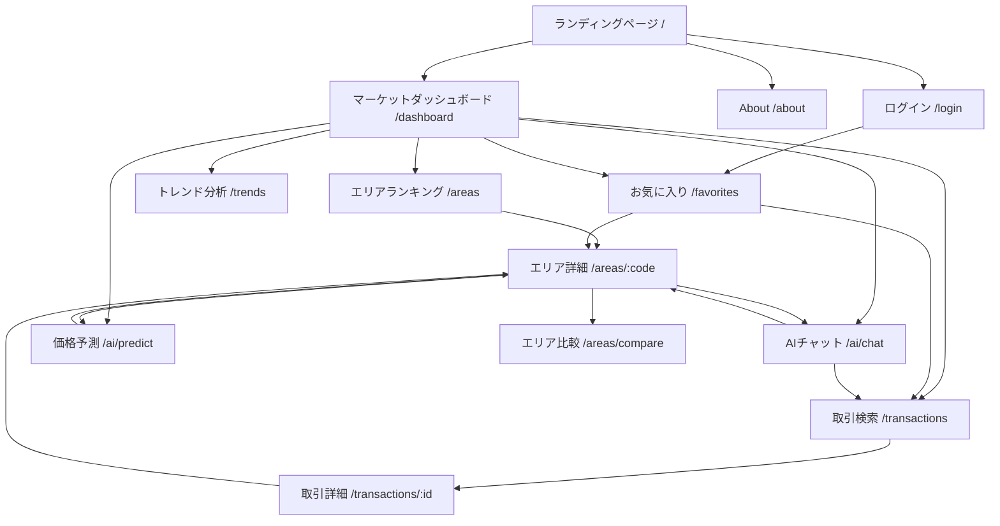
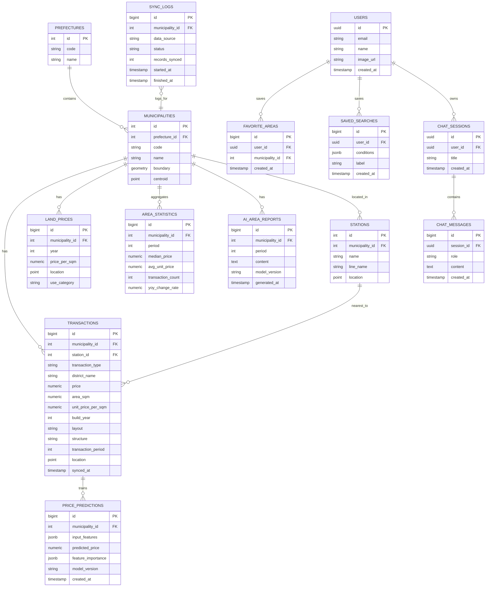

# 首都圏不動産マーケットダッシュボード 要件定義書

- 作成日: 2026-07-24
- バージョン: v0.1（初版）
- 目的: 転職活動用ポートフォリオとして公開するWebアプリケーションの要件を定義する

---

## 1. プロジェクト概要

### 1.1 コンセプト

単なる「不動産価格検索サイト」ではなく、**不動産市場を分析するための業務ツール**として設計する。実際の不動産会社の企画職・データ分析職・DX推進職が持つであろうニーズ（エリアの相場感を掴む、価格トレンドを説明する、顧客に提案する材料を作る）を想定し、それに応えるダッシュボードを構築する。

### 1.2 アピールしたいポイントと対応方針

| アピールしたい軸 | 具体的な実装での対応 |
|---|---|
| 不動産市場を分析できる | 市区町村・駅単位での統計量（中央値・坪単価・件数推移・前年同期比）、地図メッシュヒートマップ、エリア比較機能 |
| AIを活用している | LLM（Claude API）による自然言語検索・エリア講評自動生成・チャット相談、MLによる成約価格予測モデル |
| データ分析力が分かる | 統計処理（外れ値除去、坪単価正規化、時系列分析）、回帰/勾配ブースティングによる価格推定、可視化の質 |
| モダンな技術を使用している | Next.js App Router、TypeScript、PostGIS、Python分析基盤、Docker、CI/CDのモノレポ構成 |

### 1.3 対象地域

東京都・神奈川県・千葉県・埼玉県（1都3県）

### 1.4 データソース

- 国土交通省「不動産情報ライブラリ」API（不動産取引価格情報、地価公示・地価調査、都道府県/市区町村マスタ等）
- 国土数値情報（駅データ、行政区域境界、学校区域等）※将来拡張
- 上記は定期バッチで自社DBに同期し、フロントから外部APIを直接叩かない構成とする（レート制限対策・レスポンス高速化・独自集計付与のため）

---

## 2. 画面一覧

| # | 画面名 | パス例 | 概要 |
|---|---|---|---|
| 1 | ランディングページ | `/` | プロダクト概要、主要機能への導線、ポートフォリオとしての技術紹介への導線 |
| 2 | マーケットダッシュボード（メイン） | `/dashboard` | 地図＋主要統計指標＋トレンドサマリーを一画面に集約 |
| 3 | エリアランキング一覧 | `/areas` | 市区町村/駅単位の相場ランキング（坪単価・上昇率・取引件数で並べ替え） |
| 4 | エリア詳細分析 | `/areas/[code]` | 特定エリアの価格推移、間取り別相場、AI講評レポート |
| 5. | エリア比較 | `/areas/compare?codes=...` | 最大4エリアを指標横並びで比較 |
| 6 | 取引データ検索・一覧 | `/transactions` | フィルタ検索（価格帯・面積・築年数・間取り・沿線） |
| 7 | 取引詳細 | `/transactions/[id]` | 個別取引の詳細情報、周辺相場との比較 |
| 8 | 価格推移・トレンド分析 | `/trends` | 時系列グラフ、地域間トレンド比較、季節性分析 |
| 9 | AIコンシェルジュ（チャット） | `/ai/chat` | 自然言語での条件検索・市場についての質疑応答 |
| 10 | 価格予測シミュレーター | `/ai/predict` | 面積・築年数・駅距離等を入力し予測成約価格をML算出 |
| 11 | お気に入り・保存条件 | `/favorites` | ログインユーザーの保存エリア・保存検索条件 |
| 12 | ログイン | `/login` | Googleログイン（NextAuth） |
| 13 | About / 技術スタック紹介 | `/about` | ポートフォリオとしての技術解説、アーキテクチャ図、使用データソースの出典明記 |
| 14 | 404 / エラー | `/not-found` | 共通エラーページ |

---

## 3. 機能一覧

### 3.1 データ基盤機能
- 国交省 不動産情報ライブラリAPIからの定期データ同期（バッチジョブ、都県×四半期単位）
- データクレンジング（外れ値除去、表記ゆれ正規化、欠損補完）
- 住所・地名からの座標付与（ジオコーディング）
- 市区町村・駅マスタとの紐付け
- 集計テーブルへの事前バッチ集計（統計クエリの高速化）

### 3.2 検索・閲覧機能
- 取引データの複合条件検索（価格帯／面積／築年数／間取り／沿線・駅／用途）
- ページネーション・ソート
- 地図上でのメッシュヒートマップ表示（坪単価レンジで色分け）
- エリア単位ランキング（坪単価、上昇率、取引件数）
- エリア詳細（価格推移グラフ、間取り別分布、取引件数推移）
- エリア間比較（最大4エリア）

### 3.3 分析・統計機能
- 中央値／平均／坪単価／四分位範囲などの統計量算出
- 前年同期比・前四半期比のトレンド算出
- 外れ値を除いた実勢感のあるロバスト統計
- 地価公示・地価調査データとの重ね合わせ表示

### 3.4 AI活用機能
- **自然言語検索**: 「渋谷区で築10年以内、5000万円台のマンション」等の自然文をLLMの function calling で検索条件JSONへ変換
- **AIエリア講評レポート生成**: エリアの統計データをLLMに要約させ、人間が読める文章のレポートを自動生成（結果はDBにキャッシュし再生成コストを抑制）
- **AIチャット相談**: ダッシュボードのデータをコンテキストとして参照しながら市場に関する質問に回答（RAG的にDBの集計結果を都度取得しプロンプトに注入）
- **成約価格予測モデル**: 面積・築年数・最寄駅距離・エリア等を特徴量とした回帰モデル（勾配ブースティング）による価格予測とその根拠（寄与度）の可視化

### 3.5 ユーザー機能
- Googleアカウントログイン（NextAuth.js）
- お気に入りエリア／保存検索条件の登録
- （任意）比較結果・レポートのURL共有

### 3.6 非機能
- レスポンシブ対応（モバイル／デスクトップ）
- ダークモード対応
- SSR/ISRによる初期表示高速化、APIレスポンスのキャッシュ
- アクセシビリティ（コントラスト比、キーボード操作）

---

## 4. 画面遷移図



---

## 5. ER図



---

## 6. DB設計（補足）

- RDBMS: **PostgreSQL 16 + PostGIS拡張**（地理空間クエリ・メッシュ集計のため）
- ORM: Prisma（アプリ層） / SQLAlchemy（分析バッチ層）
- インデックス方針:
  - `TRANSACTIONS` に `(municipality_id, transaction_period)` の複合インデックス、`location` にGiSTインデックス
  - `AREA_STATISTICS` に `(municipality_id, period)` のユニーク制約
- パーティショニング: `TRANSACTIONS` は `transaction_period`（四半期）でレンジパーティショニングを検討（データ量増加時）
- キャッシュ層: Redisに以下をキャッシュ
  - エリア統計のAPIレスポンス（TTL: 1日、バッチ更新時に無効化）
  - AI生成レポート（`model_version` + `period` をキーに、再生成コスト削減）

---

## 7. API設計

BFF（Backend for Frontend）としてNext.js Route Handlersを配置し、フロントは常にこの内部APIのみを呼ぶ。外部（国交省API）との通信はバッチ/分析基盤側に閉じる。

### 7.1 内部API一覧

| Method | Endpoint | 概要 |
|---|---|---|
| GET | `/api/areas` | 市区町村一覧・統計サマリー（都県・並べ替え条件クエリ対応） |
| GET | `/api/areas/{code}` | エリア詳細（統計・価格推移） |
| GET | `/api/areas/{code}/report` | AI生成エリア講評（キャッシュ優先、なければ生成しキャッシュ） |
| GET | `/api/areas/compare?codes=13113,13112` | 複数エリア比較データ |
| GET | `/api/transactions` | 取引データ検索（クエリ: price_min, price_max, area_min, build_year_min, layout, station 等） |
| GET | `/api/transactions/{id}` | 取引詳細 |
| GET | `/api/trends` | 時系列トレンドデータ（都県／市区町村単位、期間指定） |
| GET | `/api/map/heatmap` | 地図メッシュ集計データ（bbox・zoomレベルに応じた粒度） |
| POST | `/api/search/nl` | 自然言語 → 検索条件JSON変換（LLM function calling） |
| POST | `/api/ai/predict` | 特徴量入力 → 予測価格＋寄与度（MLモデル呼び出し） |
| POST | `/api/ai/chat` | AIチャット（ストリーミングレスポンス、SSE） |
| GET/POST/DELETE | `/api/favorites` | お気に入りエリアのCRUD |
| GET/POST/DELETE | `/api/saved-searches` | 保存検索条件のCRUD |
| GET | `/api/auth/session` | NextAuthセッション確認 |

### 7.2 外部連携（バッチ側のみ）

- 国交省 不動産情報ライブラリAPI（不動産価格取引情報、地価公示・地価調査、市区町村マスタ、都道府県マスタ 等のエンドポイント群）
- 呼び出しはPython製の同期ジョブ（`sync-worker`）に集約し、APIキー管理・レート制御・リトライを一元化

### 7.3 レスポンス設計方針

- ページネーション: `cursor` ベース（大量取引データ対応）
- エラー形式: `{ error: { code, message } }` に統一
- キャッシュヘッダ: 統計系エンドポイントは `Cache-Control: public, max-age=3600` を付与しCDNキャッシュを活用

---

## 8. コンポーネント設計

Feature-basedディレクトリ構成を採用し、各機能（Feature）ごとにUI・hooks・APIクライアントをまとめる。

### 8.1 共通UIコンポーネント（`components/ui`）
- `Button`, `Card`, `Badge`, `Tabs`, `Dialog`, `Skeleton`, `Tooltip` などshadcn/ui由来の基本部品
- `StatTile`（統計指標カード）, `TrendBadge`（上昇/下降インジケーター）

### 8.2 データ可視化コンポーネント（`components/charts`, `components/map`）
- `PriceTrendChart`（時系列価格推移、Recharts）
- `AreaComparisonRadar`（エリア比較レーダーチャート）
- `PriceDistributionHistogram`（価格帯分布）
- `MarketMap`（MapLibre GL、メッシュヒートマップ・エリア境界描画）
- `FeatureImportanceBar`（予測モデルの寄与度可視化）

### 8.3 機能別コンポーネント（Feature Components）
- `features/areas`: `AreaRankingTable`, `AreaDetailHeader`, `AreaReportPanel`
- `features/transactions`: `TransactionFilterPanel`, `TransactionTable`, `TransactionDetailCard`
- `features/ai-chat`: `ChatWindow`, `ChatMessageBubble`, `ChatSuggestionChips`
- `features/predict`: `PredictForm`, `PredictResultCard`
- `features/favorites`: `FavoriteButton`, `SavedSearchList`

### 8.4 状態管理方針
- サーバー状態: TanStack Query（キャッシュ・再検証・ページネーション）
- クライアントUI状態（フィルタ条件、地図ビューポート等）: Zustand
- フォーム: React Hook Form + Zod（バリデーション）

---

## 9. ディレクトリ構成

分析基盤（Python）とWebアプリ（Next.js）を分離したモノレポ構成とする。

```
realestate-market-dashboard/
├── apps/
│   ├── web/                        # Next.js アプリケーション本体
│   │   ├── app/
│   │   │   ├── (marketing)/
│   │   │   │   ├── page.tsx                # ランディングページ
│   │   │   │   └── about/page.tsx
│   │   │   ├── dashboard/page.tsx
│   │   │   ├── areas/
│   │   │   │   ├── page.tsx
│   │   │   │   ├── [code]/page.tsx
│   │   │   │   └── compare/page.tsx
│   │   │   ├── transactions/
│   │   │   │   ├── page.tsx
│   │   │   │   └── [id]/page.tsx
│   │   │   ├── trends/page.tsx
│   │   │   ├── ai/
│   │   │   │   ├── chat/page.tsx
│   │   │   │   └── predict/page.tsx
│   │   │   ├── favorites/page.tsx
│   │   │   ├── login/page.tsx
│   │   │   └── api/                        # Route Handlers (BFF)
│   │   │       ├── areas/route.ts
│   │   │       ├── transactions/route.ts
│   │   │       ├── ai/{chat,predict}/route.ts
│   │   │       └── ...
│   │   ├── components/
│   │   │   ├── ui/
│   │   │   ├── charts/
│   │   │   └── map/
│   │   ├── features/
│   │   │   ├── areas/
│   │   │   ├── transactions/
│   │   │   ├── ai-chat/
│   │   │   ├── predict/
│   │   │   └── favorites/
│   │   ├── lib/
│   │   │   ├── db/                 # Prisma client
│   │   │   ├── ai/                 # LLMクライアント・プロンプト定義
│   │   │   ├── cache/              # Redisクライアント
│   │   │   └── auth/               # NextAuth設定
│   │   ├── prisma/
│   │   │   └── schema.prisma
│   │   └── package.json
│   │
│   └── analytics/                  # Python 分析・ML・バッチ基盤
│       ├── sync_worker/            # 国交省API同期ジョブ
│       │   ├── clients/reinfolib_client.py
│       │   ├── jobs/sync_transactions.py
│       │   └── jobs/sync_land_prices.py
│       ├── ml/
│       │   ├── features/
│       │   ├── training/train_price_model.py
│       │   └── serving/predict_api.py      # FastAPI（予測推論API）
│       ├── notebooks/               # EDA・分析検証用Jupyter
│       └── pyproject.toml
│
├── packages/
│   ├── shared-types/                # フロント・バックエンド共有の型定義
│   └── ui-tokens/                   # デザイントークン（色・タイポグラフィ）
│
├── infra/
│   ├── docker-compose.yml           # ローカル: PostgreSQL/PostGIS, Redis, Python API
│   └── terraform/ (任意)
│
├── docs/
│   ├── requirements.md              # 本ドキュメント
│   └── architecture.md
│
├── .github/workflows/               # CI: lint / test / build
└── README.md
```

---

## 10. 技術選定理由

| 技術 | 選定理由 |
|---|---|
| **Next.js (App Router) + TypeScript** | SSR/ISRによりSEOと表示速度を両立でき、ポートフォリオ公開時の第一印象に直結。型安全性でAPI-フロント間の不整合を防止。実務水準のモダンスタックとして評価されやすい |
| **PostgreSQL + PostGIS** | 不動産データは地理空間クエリ（近傍検索、メッシュ集計、境界内判定）が本質的に必要。単なるRDBでは表現しづらい分析要件に対応できることを示せる |
| **Python（FastAPI + scikit-learn/LightGBM）を分析基盤として分離** | 「データ分析力」を示すには、Node.jsだけで完結させず、実務で使われる分析言語・MLライブラリでモデリング工程を明示することが重要。Web層とML層を疎結合にすることで責務分離のアーキテクチャ理解もアピールできる |
| **Redis** | 外部API（国交省）のレート制限対策、AI生成レポートの再計算コスト削減、統計クエリの応答高速化 |
| **MapLibre GL JS** | オープンソースで商用利用制限がなく、ベクトルタイル・カスタムレイヤー（ヒートマップ）を軽量に実装可能。Mapboxのライセンス費用を回避しつつ同等の表現力を確保 |
| **Claude API（LLM）** | 自然言語検索の意図解釈、エリア講評の自動生成、対話型相談機能に活用。function callingで構造化データへの変換精度を担保し、単なる「ChatGPT埋め込み」ではなく実データ連携のRAG的設計であることを示す |
| **Prisma** | 型安全なDBアクセス、マイグレーション管理のしやすさ。フロントエンドエンジニア視点でも読みやすいスキーマ定義 |
| **TanStack Query + Zustand** | サーバー状態とUI状態の責務を明確に分離し、キャッシュ・再検証ロジックを宣言的に管理 |
| **Docker Compose** | ローカル環境の再現性を確保し、面接等でのデモ実行を容易にする |
| **モノレポ構成（Web / Analytics 分離）** | 実際のデータプロダクト開発で一般的な「アプリ層」と「分析・MLパイプライン層」の分離構成を再現し、設計力を示す |

---

## 11. 今後追加できる機能（拡張ロードマップ）

- **住宅ローン返済シミュレーション**（金利・借入期間を加味した月々返済額試算）
- **周辺生活利便性スコアリング**（学校・病院・商業施設等のPOIデータを組み合わせた独自指数）
- **ハザードマップ重畳表示**（浸水想定区域・地震リスク等との重ね合わせ）
- **賃貸データ対応**（売買だけでなく賃料相場・利回り分析への拡張）
- **投資利回りシミュレーター**（表面利回り・実質利回り試算、賃貸データとの組み合わせ）
- **レコメンド機能**（閲覧・お気に入り履歴からのエリア/物件レコメンド）
- **エリアレポートのPDFエクスポート**（営業資料としての利用を想定）
- **多言語対応**（英語版、海外投資家向け）
- **PWA化・プッシュ通知**（価格変動アラート）
- **管理者向けダッシュボード**（データ同期状況の監視、AI利用状況モニタリング）
- **時系列予測モデルへの拡張**（現在の回帰モデルに加え、将来の価格トレンド予測）

---

## 12. 補足・注意事項

- 国土交通省 不動産情報ライブラリのデータ利用にあたっては、利用規約・出典表記ルールを`/about`ページに明記する
- APIキー等のシークレットは環境変数で管理し、リポジトリには含めない
- ポートフォリオ公開を前提とし、個人情報を含むデータ（取引当事者情報等）は取り扱わない（提供データも統計的な取引情報のみ）
